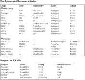

#### Clinical Study Design 
&nbsp;&nbsp;&nbsp;&nbsp;&nbsp;&nbsp;Sixteen women age 18–70 years old with obesity (BMI ≥ 30 kg/m²) and pre‑diabetes were enrolled and were treated with empagliflozin 25 mg/day (Boehringer Ingelheim) in an open‑label, single‑arm design. Pre-diabetes was defined using the American Diabetes Association criteria as either impaired fasting glucose between 100-125 mg/dL, impaired glucose tolerance after a 75-gram glucose challenge of 140-199 mg/dL, or hemoglobin A1c 5.7-6.4%. Pregnancy was excluded in women of child-bearing potential by urine β-human chorionic gonadotropin. Individuals with type 1 or type 2 diabetes, significant cardiovascular, neurologic, hematologic, immunologic, liver or renal disease, history of pancreatitis, recurrent vulvovaginitis, urinary tract infections, Fournier’s gangrene, and treatment with chronic systemic steroids or loop diuretics were excluded. 
&nbsp;&nbsp;&nbsp;&nbsp;&nbsp;&nbsp;The protocol was approved by the Vanderbilt University Medical Center Institutional Review Board, conducted in accordance with the Declaration of Helsinki, and registered at ClinicalTrials.gov (NCT04907214). All participants provided written informed consent. 

#### Study Day Procedures 
&nbsp;&nbsp;&nbsp;&nbsp;&nbsp;&nbsp;Participants completed a screening visit and three study days. Participants first reported to the Vanderbilt Clinical Research Center to undergo screening after an overnight fast. We obtained a medical history, completed a physical examination, and collected blood. We performed a 75-gram oral glucose tolerance test with samples drawn at 0, 30, 60, 90 and 120 minutes. On the morning of each study day (baseline before drug, 2 and 12 weeks after drug), participants arrived at the Vanderbilt Clinical Research Center after an overnight fast. We collected anthropometric measures, blood for glucose and peripheral blood mononuclear cells (PBMCs). 

#### PBMC Isolation and Cryopreservation 
&nbsp;&nbsp;&nbsp;&nbsp;&nbsp;&nbsp;Peripheral blood was collected in EDTA tubes and processed within two hours of collection. PBMCs were isolated using Ficoll-Paque density gradient centrifugation following standardized barrier tube preparation and sequential washes with calcium- and magnesium-free PBS. Cells were resuspended in cryopreservation medium consisting of 90% fetal bovine serum and 10% DMSO at a concentration of 5–10 million cells per vial, gradually frozen using a controlled-rate freezing container at -80°C, and subsequently transferred to liquid nitrogen storage until analysis. 

#### Single-Cell RNA Sequencing (scRNASeq) Library Preparation and Sequencing 
&nbsp;&nbsp;&nbsp;&nbsp;&nbsp;&nbsp;PBMCs from eight individuals were thawed in PBS and S7 nuclease. Red blood cells were lysed with ACK lysis buffer, then cells were washed in PBS with 1% BSA, counted, and pooled (3 individuals per lane) prior to submission to the VANderbilt Technologies for Advanced GEnomics core (VANTAGE) for scRNASeq. A fraction of each sample was taking for DNA extraction as below. 
&nbsp;&nbsp;&nbsp;&nbsp;&nbsp;&nbsp;ScRNASeq libraries were prepared using the Chromium Single Cell 5’ HT v2 platform (10X Genomics) according to the manufacturer’s protocol. Briefly, 60,000 cells were loaded into each channel of the Chromium X controller to achieve the target cell recovery of 30,000 cells. Cells were partitioned into Gel Bead Emulsion (GEMs), where cell lysis and barcoded reverse transcription of the RNA occurred, followed by cDNA amplification. Amplified cDNA was purified using SPRI beads and dual indexed libraries were constructed by fragmentation, end repair, A-tailing, adapter ligation, and PCR amplification. 
&nbsp;&nbsp;&nbsp;&nbsp;&nbsp;&nbsp;The library quality was assessed using a Bioanalyzer and quantified using a qPCR-based method with the KAPA Library Quantification Kit (P/N: KK4873) and the QuantStudio 12K instrument. 
&nbsp;&nbsp;&nbsp;&nbsp;&nbsp;&nbsp;Prepared libraries were pooled in equimolar ratios, and the resulting pool was subjected to cluster generation using the NovaSeq 6000 System, following the manufacturer's protocols. 150 bp paired-end sequencing was performed on the NovaSeq 6000 platform targeting 50,000 reads per cell. Raw sequencing data (FASTQ files) obtained from the NovaSeq 6000 was subjected to quality control analysis, including read quality assessment. Real Time Analysis Software (RTA) and NovaSeq Control Software (NCS) (1.8.0; Illumina) were used for base calling. MultiQC (v1.7; Illumina) was used for data quality assessments. 

#### Genotyping 
&nbsp;&nbsp;&nbsp;&nbsp;&nbsp;&nbsp;DNA samples were QC’d and normalized to 50ng/ul for the Illumina MegaEX assay. Illumina genotyping was performed utilizing the infinium LCG chemistry along with the Multi-Ethnic Global Array (MEGA) with added custom content, which amounts to 1.8 million SNPs. The samples were processed using the Tecan Evo liquid handler and Bead Arrays were scanned on the Illumina iScan instrument. All samples produced call rates>0.996. Project’s deliverables included raw data (idats), GTC files, Sample sheet, SNP manifest files in. bpm format, Cluster file for the VUMC MEGA Ex’s custom chip, PLINK files on forward strand, build 37, and a Genome Studio projects. 

#### Genetic Demultiplexing 
&nbsp;&nbsp;&nbsp;&nbsp;&nbsp;&nbsp;PLINK files from genotyping were converted to VCF format using plink v2.00a5.9LM AVX2 AMD.1 Lift over to GRCh38 was done with picard v2.11.2 The UCSC GRCh38/hg38 assembly3 was used as the target reference build. FASTQ files from scRNASeq were processed using 10x Genomics Cell Ranger Count v7.1.0 using 10x Genomics Cloud Analysis.4 A KIR-modified GRCh38 reference5 was used for read alignment. Souporcell6 was used for genetic demultiplexing of the Cell Ranger counts and annotation of inter-sample doublets. The Demuxafy7 Assign_Indiv_by_Geno method was used to calculate the strength of correlation between variants called by genomic sequencing and those called by Souporcell. These variant call correlations were used to map sample IDs to Souporcell genetic clusters and subsequently to each barcode. 

#### RNASeq Doublet Finding 
&nbsp;&nbsp;&nbsp;&nbsp;&nbsp;&nbsp;The Solo algorithm8 as implemented by the scvi-tools9 python library was used to identify intra-sample doublets. This was done separately on each Cell Ranger count output. Barcodes called doublet or unassigned by Souporcell were dropped for Solo. Additionally, cells with counts from less than 200 genes and genes not expressed in at least 10 cells were removed. Highly variable genes (HVG, n = 5000) were calculated and a single-cell Variational Inference (scVI) model was trained on the HVG. The trained model was used to facilitate the Solo scoring and predictions. Predicted doublets were annotated. 
&nbsp;&nbsp;&nbsp;&nbsp;&nbsp;&nbsp;Using the R programming language v4.3.110 and Seurat v5,11 a Seurat object was constructed containing counts from all counts matrices with barcode-linked metadata. Barcodes assigned 'doublet' or 'unassigned' by Souporcell or barcodes assigned 'doublet' by Solo were dropped. The raw counts matrix, object metadata, and gene names were saved to file. To make use of the many scverse tools,12 these core elements were used to construct an anndata13 object in Python v3.9.18. 

#### RNASeq Integration 
&nbsp;&nbsp;&nbsp;&nbsp;&nbsp;&nbsp;Cells with counts from less than 200 genes or more than 10% counts from mitochondrial (MT) genes were removed. Genes not expressed in at least 10 cells were removed. HVG were selected and a scVI model with hyperparameter ray tuning14 was trained on the data for integration of the counts data. The selection of HVG included calculation of the 5000 most HVG followed by dropping TCR, IG, and XY genes from the set. TRAV1-2, a MAIT marker, was then added back to the set. Batch key was set to sequencing lane with categorical covariate set to sample ID. Two additional continuous model covariates were used: percentage of counts from MT genes and total counts. A nearest-neighbor search (k = 30, kNN) was done on the model latent space. The nearest neighbor graph was used for Leiden clustering15 and Uniform Manifold Approximation and Projection (UMAP)16 coordinate calculation. Myeloid cell clusters, including several monocyte and dendritic cell populations, were identified using top gene markers. Platelet cells were similarly identified. 
&nbsp;&nbsp;&nbsp;&nbsp;&nbsp;&nbsp;Myeloid cells were subset and re-integrated and re-clustered as previously described. Cells were labeled as follows: cMono (classical monocyte, CD14+ monocyte), nMono (non-classical monocyte, CD16+ monocyte), cDC1 (conventional type 1 dendritic cell), cDC2 (conventional type 2 dendritic cell), or pDC (plasmacytoid dendritic cell). Additionally, a cluster showing evidence of both platelet and classical monocyte genes was labeled MPA (monocyte-platelet aggregate). 

#### RNASeq Doublet Analysis 
&nbsp;&nbsp;&nbsp;&nbsp;&nbsp;&nbsp;Care was taken to determine whether the MPA group should be treated as persistent technical doublets or as a biologically relevant type. To start, Solo-assigned doublets and Souporcell-assigned doublets were reintroduced into the complete, cleaned dataset. This dataset was integrated and clustered as before. The myeloid and platelet cell clusters were annotated. These two groups were then re-integrated and re-clustered. Any previously annotated doublets that expressed primarily platelet or myeloid markers were included in this integration and clustering. Several metrics were then calculated per cell cluster: % singlet, % Solo doublet, and % Souporcell doublet. Souporcell doublets define inter-sample, purely technical doublets. Within our dataset, Solo doublets define intra-sample doublets and are classified through doublet simulation. Rates for these three types were compared across cell clusters. Cells in clusters with much higher Souporcell doublet rates than others were annotated as "true" doublets. 

#### RNASeq Monocyte-Platelet Aggregate Simulation 
&nbsp;&nbsp;&nbsp;&nbsp;&nbsp;&nbsp;Platelet- and cMono-labeled cells were taken from the previous labeling that did not include Solo or Souporcell doublets. For each study participant, for each study day, the Platelet and cMono counts matrices were subset and used to simulate a cMono-Platelet doublet by randomly sampling and combining the counts from one Platelet and one cMono. This ensured that simulated doublets (SimMPA) would only include counts summed from cells from the same study participant and same study day. Each Platelet in the dataset was only sampled once when summing counts. For each patient-study timepoint there were more cMono than Platelet. Subsequently, the final number of simulated doublets was equal to the number of Platelets in the dataset. This number was similar to the number of annotated MPAs. The final counts for the three cell types were: MPA (n = 3565), Platelet (n = 2843), SimMPA (n = 2843). SimMPAs were assigned barcode labels with a trailing '-dbl' tag. Similarly, metadata entries for these simulated doublets were mapped based on study participant and study day from which the counts were summed. Care was taken to count-normalize and log1p transform the simulated counts whenever comparisons were made to account for the inflated library sizes. 

#### RNAseq Visualization 
&nbsp;&nbsp;&nbsp;&nbsp;&nbsp;&nbsp;To visualize differences between annotated myeloid cell groups, Platelets, MPAs, and SimMPAs, a dot plot was created with the scanpy python package17 pl.dotplot function. Normalized log1p counts were used. To visualize the various cell groups in two-dimensional space, several UMAP plots were created using the ggplot2 R package.18 

#### RNASeq Differential Gene Expression (DGE) and Gene Set Enrichment Analysis (GSEA) 
&nbsp;&nbsp;&nbsp;&nbsp;&nbsp;&nbsp;The MAST R package19 was used for all DGE testing. Cellular detection rate, defined as the number of detected genes per cell and a known source of technical variability, was used as a fixed-effect covariate. Sample ID was used as a random-effect variable to counteract assumptions of cell independence and avoid model overfitting. Genes not expressed in at least 10% of cells in either test group were filtered out prior to DGE testing. When testing for differences between aggregate Monocytes and non-aggregate cMonos, Platelet genes were filtered out prior to MAST testing. Platelet genes were identified as genes that were significantly upregulated by Platelets relative to the cMono group in the dataset. This was done to mitigate the influence of Platelet genes expressed by the aggregate Platelets. 
&nbsp;&nbsp;&nbsp;&nbsp;&nbsp;&nbsp;MAST log fold change (logFC) estimates per gene, obtained using the getLogFC MAST function, were used to rank the genes for GSEA. The MSigDB v7.5.1 Hallmark gene sets in GMT format20 was used. Gene sets containing fewer than 15 or more than 500 genes were excluded to avoid overly narrow or broad pathways. GSEA was performed using the fgsea R package (v1.20.0).21 We considered pathways significant at Benjamini–Hochberg–adjusted p < 0.05. To obtain bar plots, we plotted normalized enrichment scores (NES) on the x‑axis and pathways on the y‑axis, colored by –log10(adjusted p). 

#### RNASeq Differential Composition Analysis of Cell-Type Frequencies 
&nbsp;&nbsp;&nbsp;&nbsp;&nbsp;&nbsp;The sccomp method22 was used to infer the significance of differential distribution for each cell type across different time points compared to baseline. A Bayesian regression model was fitted to cell counts using sum-constrained independent beta-binomial distributions. Time point (baseline, 2 weeks, and 12 weeks) was included as a three-level categorical independent variable, and random intercepts were incorporated to account for within-subject correlation. The composition parameters represent logit fold changes in cell proportions between baseline and 2 weeks, and between baseline and 12 weeks. The probability of the null hypothesis (i.e., no difference between baseline and other time points) for each group was determined by estimating the posterior probability that the composition parameters exceed a pre-specified fold-change threshold of 0.2. The false discovery rate (FDR) was calculated by ranking the null hypothesis probabilities in ascending order and computing the cumulative average, as described by Stephens.23 A significant differential composition was defined as FDR < 0.05. As a sensitivity analysis, additional models were fitted with the use of platelet-modifying drug included as a covariate. 

#### Laboratory Analyses 
&nbsp;&nbsp;&nbsp;&nbsp;&nbsp;&nbsp;Glucose was measured either by 1) a YSI glucose analyzer (YSI Life Sciences, Yellow Springs, OH) (first six individuals OGTT and fasting study day glucose when a YSI analyzer and a technician to operate the YSI were available), 2) a point-of-care glucometer (last ten individuals OGTT when YSI analyzer was no longer available); or 3) Vanderbilt clinical labs (last ten individuals fasting study day glucose when YSI analyzer was no longer available). Hemoglobin A1c was measured using high pressure liquid chromatography. 

#### Microscopy 
&nbsp;&nbsp;&nbsp;&nbsp;&nbsp;&nbsp;After thawing, PBMCs were washed and seeded onto poly-L-lysine 12mm glass coverslips (Corning, 354085), incubated for 60 minutes at 37°C to allow adherence, then fixed with 4% paraformaldehyde for 15 minutes at room temperature. After blocking for 1 hour with 3% normal goat serum and 1% BSA in PBS, cells were stained overnight at 4°C with primary antibodies against CD41a, CD14, and CD16 (1:800 dilution). The next day, samples were incubated with Alexa Fluor-conjugated secondary antibodies (1:500 dilution) for 2 hours at room temperature in the dark and counterstained with DAPI (1:4000 in PBS) for 3 minutes. Coverslips were mounted onto glass slides with Aqua-Poly/Mount, Polysciences, 18606-20. 
&nbsp;&nbsp;&nbsp;&nbsp;&nbsp;&nbsp;Imaging was performed at Vanderbilt’s Cell Imaging Shared Resource core on a Nikon Ti microscope with a Yokogawa CSU-X1 spinning disk head and Nikon Plan Apo Lambda Oil 60x 1.40 NA WD 0.13mm objective. Images were captured with a Photometrics Prime 95B sCMOS camera using 405-, 488-, 561-, and 647-nm solid-state lasers and standard filter sets. Images were acquired using NIS-Elements (Nikon) software. SDC imaging was performed through use of the Vanderbilt Cell Imaging Shared Resource. 

#### Flow Cytometry Metabolic Profiling 
&nbsp;&nbsp;&nbsp;&nbsp;&nbsp;&nbsp;Metabolic activity was assessed using the SCENITH assay.24. Cryopreserved PBMCs were thawed, rested overnight in R10 media supplemented with human serum, and treated with puromycin (10 µg/mL, 15 min) in the presence or absence of metabolic inhibitors: oligomycin (1 µM), 2-deoxy-D-glucose (100 mM), etomoxir (40 µM), CB-839 (1 µM), or DGO(2DG+Oligomycin). Samples were stained with an optimized antibody panel (Table S1), acquired on a Cytek Aurora flow cytometer, and analyzed in FlowJo v10. Analysis was performed using manual gating to quantify changes in metabolic dependencies and cell subset frequencies across study days. Only high-quality, live singlet lymphocyte and monocyte populations were included in downstream analyses. 

 
 
__Supplemental References__
1. 	Purcell S, Neale B, Todd‐Brown K, others. PLINK: A tool set for whole‐genome association and population‐based linkage analyses. Am J Hum Genet [Internet]. 2007;81:559–575. Available from: http://pngu.mgh.harvard.edu/purcell/plink/
2. 	Broad Institute. Picard Toolkit [Internet]. 2019;Available from: https://broadinstitute.github.io/picard/
3. 	UCSC Genome Browser. Human GRCh38/hg38 Assembly [Internet]. 2025;Available from: https://genome.ucsc.edu/cgi-bin/hgGateway?db=hg38
4. 	Zheng GXY, Terry JM, Belgrader P, others. Massively parallel digital transcriptional profiling of single cells. Nat Commun. 2017;8:14049. 
5. 	Alves E, Chopra A, Ram R, Currenti J, Kalams SA, Mallal SA, Phillips EJ, Gaudieri S. Underrepresentation of activating KIR gene expression in single‐cell RNA‐seq data is due to KIR gene misassignment. Eur J Immunol. 2024;54:e2350590. 
6. 	Heaton H, Talman AM, Knights A, others. Souporcell: Robust clustering of single-cell RNA-seq by genotype and ambient RNA inference without reference genotypes. bioRxiv. 2020;
7. 	Neavin D, Senabouth A, Arora H, others. Demuxafy: improvement in droplet assignment by integrating multiple single-cell demultiplexing and doublet detection methods. Genome Biol. 2024;25:94. 
8. 	Bernstein NJ, Fong NL, Lam I, Roy MA, Hendrickson DG, Kelley DR. Solo: Doublet identification in single-cell RNA-Seq via semi-supervised deep learning. Cell Syst. 2020;
9. 	Gayoso A, Lopez R, Xing G, others. A Python library for probabilistic analysis of single-cell omics data. Nat Biotechnol. 2022;40:163–166. 
10. R Core Team. R: A Language and Environment for Statistical Computing [Internet]. 2024;Available from: https://www.R-project.org/
11. Hao Y, Stuart T, Kowalski MH, others. Dictionary learning for integrative, multimodal and scalable single-cell analysis. Nat Biotechnol. 2024;42:293–304. 
12. Virshup I, Bredikhin D, Heumos L, others. The scverse project provides a computational ecosystem for single-cell omics data analysis. Nat Biotechnol. 2023;41:604–606. 
13. Virshup I, Rybakov S, Theis FJ, Angerer P, Wolf FA. anndata: Annotated data for omics analysis. J Open Source Softw. 2024;9:4371. 
14. Liaw R, Liang E, Nishihara R, Moritz P, Gonzalez J, Stoica I. Tune: A Research Platform for Distributed Model Selection and Hyperparameter Optimization. 2018;
15. Traag VA, Waltman L, van Eck NJ. From Louvain to Leiden: guaranteeing well-connected communities. Sci Rep. 2019;9:5233. 
16. Healy J, McInnes L. Uniform manifold approximation and projection. Nature Reviews Methods Primers. 2024;4:82. 
17. Wolf F, Angerer P, Theis F. SCANPY: large-scale single-cell gene expression data analysis. Genome Biol. 2018;19:15. 
18. Wickham H. ggplot2: Elegant Graphics for Data Analysis [Internet]. Springer-Verlag New York; 2016. Available from: https://ggplot2.tidyverse.org
19. Finak G, McDavid A, Yajima M, others. MAST: a flexible statistical framework for assessing transcriptional changes and characterizing heterogeneity in single-cell RNA sequencing data. Genome Biol. 2015;16:278. 
20. Liberzon A, Birger C, Thorvaldsdóttir H, Ghandi M, Mesirov JP, Tamayo P. The Molecular Signatures Database Hallmark Gene Set Collection. Cell Syst. 2015;1:417–425. 
21. Korotkevich G, Sukhov V, Budin N, Shpak B, Artyomov MN, Sergushichev A. Fast gene set enrichment analysis. 2016;
22. Mangiola S, Roth-Schulze AJ, Trussart M, Zozaya-Valdés E, Ma M, Gao Z, Rubin AF, Speed TP, Shim H, Papenfuss AT. sccomp: Robust differential composition and variability analysis for single-cell data. Proceedings of the National Academy of Sciences. 2023;120. 
23. Stephens M. False discovery rates: a new deal. Biostatistics. 2016;kxw041. 
24. Argüello RJ, Combes AJ, Char R, Gigan J-P, Baaziz AI, Bousiquot E, Camosseto V, Samad B, Tsui J, Yan P, Boissonneau S, Figarella-Branger D, Gatti E, Tabouret E, Krummel MF, Pierre P. SCENITH: A Flow Cytometry-Based Method to Functionally Profile Energy Metabolism with Single-Cell Resolution. Cell Metab. 2020;32:1063-1075.e7. 
 

