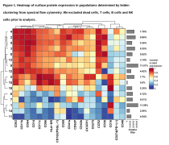
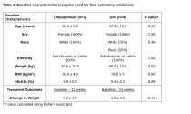
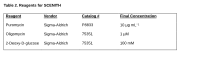
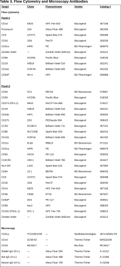

Pipeline script documentation: [pipeline_docs/code_doc.md](pipeline_docs/code_doc.md)

#### Data Availability Statement 
&nbsp;&nbsp;&nbsp;&nbsp;&nbsp;&nbsp;Raw sequencing data have been deposited in the NCBI Sequence Read Archive under BioProject accession PRJNA1460384. Analytic code is available in this GitHub repository. Additional study materials are available upon reasonable request. 

#### Clinical Study Design 
&nbsp;&nbsp;&nbsp;&nbsp;&nbsp;&nbsp;The objective of this pilot study was to evaluate the immune effects of empagliflozin in humans, including in blood. 

&nbsp;&nbsp;&nbsp;&nbsp;&nbsp;&nbsp;Sixteen women age 18–70 years old with obesity (BMI ≥ 30 kg/m²) and pre‑diabetes were enrolled and were treated with empagliflozin 25 mg/day (Boehringer Ingelheim) in an open‑label, single‑arm design. Pre-diabetes was defined using the American Diabetes Association criteria as either impaired fasting glucose between 100-125 mg/dL, impaired glucose tolerance after a 75-gram glucose challenge of 140-199 mg/dL, or hemoglobin A1c 5.7-6.4%. Pregnancy was excluded in women of child-bearing potential by urine β-human chorionic gonadotropin. Individuals with type 1 or type 2 diabetes, significant cardiovascular, neurologic, hematologic, immunologic, liver or renal disease, history of pancreatitis, recurrent vulvovaginitis, urinary tract infections, Fournier’s gangrene, and treatment with chronic systemic steroids or loop diuretics were excluded. 

&nbsp;&nbsp;&nbsp;&nbsp;&nbsp;&nbsp;The protocol was approved by the Vanderbilt University Medical Center Institutional Review Board (IRB# 210907), conducted in accordance with the Declaration of Helsinki, and registered at ClinicalTrials.gov (NCT04907214). All participants provided written informed consent. 

&nbsp;&nbsp;&nbsp;&nbsp;&nbsp;&nbsp;All study procedures were conducted at the Vanderbilt Clinical Research Center (Nashville, TN). Potentially eligible participants were identified using an IRB-approved electronic health record screening tool, contacted via IRB-approved chart messaging, phone calls, or emails. Screening began August 2021 and all study procedures were completed by December 2023. 

#### Study Day Procedures 
&nbsp;&nbsp;&nbsp;&nbsp;&nbsp;&nbsp;Participants completed a screening visit and three study days. Participants first reported to the Vanderbilt Clinical Research Center to undergo screening after an overnight fast. We obtained a medical history, completed a physical examination, and collected blood. We performed a 75-gram oral glucose tolerance test with samples drawn at 0, 30, 60, 90 and 120 minutes. On the morning of each study day (baseline before drug, 2 and 12 weeks after drug), participants arrived at the Vanderbilt Clinical Research Center after an overnight fast. We collected anthropometric measures, blood for glucose and peripheral blood mononuclear cells (PBMCs). 

#### PBMC Isolation and Cryopreservation 
&nbsp;&nbsp;&nbsp;&nbsp;&nbsp;&nbsp;Peripheral blood was collected in EDTA tubes and processed within two hours of collection using a standard and [validated protocol](https://www.hanc.info/resources/sops-guidelines-resources/laboratory/cross-network-pbmc-processing-sop.html). PBMCs were isolated using Ficoll-Paque density gradient centrifugation following standardized barrier tube preparation and sequential washes with calcium- and magnesium-free PBS. Cells were resuspended in cryopreservation medium consisting of 90% fetal bovine serum and 10% DMSO at a concentration of 5–10 million cells per vial, gradually frozen using a controlled-rate freezing container at -80°C, and subsequently transferred to liquid nitrogen storage until analysis. Typical samples have >80% viability and >70% cell recovery. On average 85.7% of cells were negative for an amine-reactive dye (Zombie Violet, Biolegend) in the reported experiments. 

#### Single-Cell RNA Sequencing (scRNASeq) Library Preparation and Sequencing 
&nbsp;&nbsp;&nbsp;&nbsp;&nbsp;&nbsp;PBMCs from eight individuals were thawed in PBS and S7 nuclease. Red blood cells were lysed with ACK lysis buffer, then cells were washed in PBS with 1% BSA, counted, and pooled (3 individuals per lane) prior to submission to the VANderbilt Technologies for Advanced GEnomics core (VANTAGE) for scRNASeq. A fraction of each sample was taking for DNA extraction as below. 
&nbsp;&nbsp;&nbsp;&nbsp;&nbsp;&nbsp;ScRNASeq libraries were prepared using the Chromium Single Cell 5’ HT v2 platform (10X Genomics) according to the manufacturer’s protocol. Briefly, 60,000 cells were loaded into each channel of the Chromium X controller to achieve the target cell recovery of 30,000 cells. Cells were partitioned into Gel Bead Emulsion (GEMs), where cell lysis and barcoded reverse transcription of the RNA occurred, followed by cDNA amplification. Amplified cDNA was purified using SPRI beads and dual indexed libraries were constructed by fragmentation, end repair, A-tailing, adapter ligation, and PCR amplification. 
&nbsp;&nbsp;&nbsp;&nbsp;&nbsp;&nbsp;The library quality was assessed using a Bioanalyzer and quantified using a qPCR-based method with the KAPA Library Quantification Kit (P/N: KK4873) and the QuantStudio 12K instrument. 
&nbsp;&nbsp;&nbsp;&nbsp;&nbsp;&nbsp;Prepared libraries were pooled in equimolar ratios, and the resulting pool was subjected to cluster generation using the NovaSeq 6000 System, following the manufacturer's protocols. 150 bp paired-end sequencing was performed on the NovaSeq 6000 platform targeting 50,000 reads per cell. Raw sequencing data (FASTQ files) obtained from the NovaSeq 6000 was subjected to quality control analysis, including read quality assessment. Real Time Analysis Software (RTA) and NovaSeq Control Software (NCS) (1.8.0; Illumina) were used for base calling. MultiQC (v1.7; Illumina) was used for data quality assessments. 

#### Genotyping 
&nbsp;&nbsp;&nbsp;&nbsp;&nbsp;&nbsp;DNA samples were QC’d and normalized to 50ng/ul for the Illumina MegaEX assay. Illumina genotyping was performed utilizing the infinium LCG chemistry along with the Multi-Ethnic Global Array (MEGA) with added custom content, which amounts to 1.8 million SNPs. The samples were processed using the Tecan Evo liquid handler and Bead Arrays were scanned on the Illumina iScan instrument. All samples produced call rates>0.996. Project’s deliverables included raw data (idats), GTC files, Sample sheet, SNP manifest files in. bpm format, Cluster file for the VUMC MEGA Ex’s custom chip, PLINK files on forward strand, build 37, and a Genome Studio projects. 

#### Genetic Demultiplexing 
&nbsp;&nbsp;&nbsp;&nbsp;&nbsp;&nbsp;PLINK files from genotyping were converted to VCF format using plink v2.00a5.9LM AVX2 AMD.1 Lift over to GRCh38 was done with picard v2.11.2 The UCSC GRCh38/hg38 assembly3 was used as the target reference build. FASTQ files from scRNASeq were processed using 10x Genomics Cell Ranger Count v7.1.0 using 10x Genomics Cloud Analysis.4 A [KIR-modified GRCh38 reference (DOI: 10.1002/eji.202350590)](https://doi.org/10.1002/eji.202350590)5 was used for read alignment. Souporcell6 was used for genetic demultiplexing of the Cell Ranger counts and annotation of inter-sample doublets. The Demuxafy7 Assign_Indiv_by_Geno method was used to calculate the strength of correlation between variants called by genomic sequencing and those called by Souporcell. These variant call correlations were used to map sample IDs to Souporcell genetic clusters and subsequently to each barcode. 

#### RNASeq Doublet Finding 
&nbsp;&nbsp;&nbsp;&nbsp;&nbsp;&nbsp;The Solo algorithm8 as implemented by the scvi-tools9 python library was used to identify intra-sample doublets. This was done separately on each Cell Ranger count output. Barcodes called doublet or unassigned by Souporcell were dropped for Solo. Additionally, cells with counts from less than 200 genes and genes not expressed in at least 10 cells were removed. Highly variable genes (HVG, n = 5000) were calculated and a single-cell Variational Inference (scVI) model was trained on the HVG. The trained model was used to facilitate the Solo scoring and predictions. Predicted doublets were annotated. 
&nbsp;&nbsp;&nbsp;&nbsp;&nbsp;&nbsp;Using the R programming language v4.3.110 and Seurat v5,11 a Seurat object was constructed containing counts from all counts matrices with barcode-linked metadata. Barcodes assigned 'doublet' or 'unassigned' by Souporcell or barcodes assigned 'doublet' by Solo were dropped. The raw counts matrix, object metadata, and gene names were saved to file. To make use of the many scverse tools,12 these core elements were used to construct an anndata13 object in Python v3.9.18. 

#### RNASeq Integration 
&nbsp;&nbsp;&nbsp;&nbsp;&nbsp;&nbsp;After singlet filtering, cells with fewer than 200 detected genes or more than 10% mitochondrial counts were removed, and genes expressed in fewer than 10 cells were excluded. We selected 5000 highly variable genes, removed TCR/IG/XY genes, and added TRAV1-2 back. A scVI model with ray tuning14 was trained with lane as batch key, sample ID as a categorical covariate, and mitochondrial fraction plus total counts as continuous covariates. The latent space was used for k-nearest-neighbor graph construction (k = 30), Leiden clustering15, and UMAP16 embedding. 
&nbsp;&nbsp;&nbsp;&nbsp;&nbsp;&nbsp;From this integrated singlet branch, myeloid and platelet populations were identified by marker expression. Myeloid cells were re-integrated and re-clustered to define cMono (CD14+), nMono (CD16+), cDC1, cDC2, pDC, and an MPA cluster with concurrent monocyte and platelet signal. 

#### RNASeq Doublet Analysis 
&nbsp;&nbsp;&nbsp;&nbsp;&nbsp;&nbsp;To test whether MPAs were likely technical artifacts, we ran a separate doublet-inclusive branch. This branch included Souporcell singlets restricted to barcodes present in the singlet branch together with Souporcell-flagged inter-sample doublets, then performed independent re-integration and re-clustering with cluster labels assigned by marker expression and Souporcell-doublet enrichment. This doublet-inclusive branch was used only to evaluate whether observed MPA-labeled cells localized with technical-doublet-enriched clusters; longitudinal MPA frequency estimates were derived from the singlet-filtered myeloid branch. 
&nbsp;&nbsp;&nbsp;&nbsp;&nbsp;&nbsp;Within this branch, we quantified cluster-level singlet and Souporcell-doublet frequencies to compare observed MPAs directly against technical-doublet-enriched clusters, platelets, and other myeloid-lineage populations. 

#### RNASeq Monocyte-Platelet Aggregate Simulation 
&nbsp;&nbsp;&nbsp;&nbsp;&nbsp;&nbsp;Platelet- and cMono-labeled cells used for simulation were taken from the singlet branch annotations (that is, from the object with technical doublets removed). For each study participant and study day, platelet and cMono count matrices were subset and used to generate simulated monocyte-platelet aggregates (SimMPA) by randomly sampling one platelet and one cMono and summing their counts. This constrained each SimMPA to within-participant, within-study-day pairing. 
&nbsp;&nbsp;&nbsp;&nbsp;&nbsp;&nbsp;The objective of this simulation branch was to benchmark how these SimMPA profiles compare with observed MPA profiles under the same integration and downstream analysis workflow, rather than to create generic synthetic doublets as a standalone endpoint. 
&nbsp;&nbsp;&nbsp;&nbsp;&nbsp;&nbsp;Each platelet was sampled once when generating SimMPA cells. Because cMonos outnumbered platelets across participant-timepoint strata, the final SimMPA count equaled the platelet count. Final counts were: MPA (n = 3565), platelet (n = 2843), SimMPA (n = 2843). SimMPAs were assigned barcodes with a trailing '-dbl' tag, and metadata were mapped from the participant/timepoint used to generate each synthetic cell. In the integrated simulation object, synthetic cells were explicitly labeled `merged_type = cMo_Platelet_doublet` while original singlet labels were retained for observed cells. For harmonized reporting/visualization, labels were then mapped as M-platelet → MPA and cMo_Platelet_doublet → SimMPA (with CD14 Mono → cMono and CD16 Mono → nMono where those lineages were shown). Simulated counts were normalized and log1p-transformed prior to expression-space comparisons to account for increased library size after summation. 

#### RNAseq Visualization 
&nbsp;&nbsp;&nbsp;&nbsp;&nbsp;&nbsp;To visualize relationships among MPAs, technical-doublet-enriched clusters, platelets, and other myeloid populations, we generated UMAP panels for the singlet, doublet-inclusive, and simulation branches. We also generated a marker dot plot using scanpy17 and ggplot2-based figures18 from normalized log1p expression. 
&nbsp;&nbsp;&nbsp;&nbsp;&nbsp;&nbsp;For frequency visualization, we summarized per-sample myeloid cell-type counts and plotted MPA and cMono frequencies across baseline, 2-week, and 12-week study days to show the observed decline in MPA frequency over time with SGLT2 inhibitor treatment in this cohort. 

#### RNASeq Differential Gene Expression (DGE) and Gene Set Enrichment Analysis (GSEA) 
&nbsp;&nbsp;&nbsp;&nbsp;&nbsp;&nbsp;We used MAST19 for DGE contrasts relevant to the primary analyses, including cross-study-day changes in key myeloid populations, MPA versus cMono contrasts, and observed MPA versus SimMPA contrasts. Cellular detection rate was modeled as a fixed-effect technical covariate and sample ID as a random effect. Genes expressed in fewer than 10% of cells in either comparison group were removed before testing. 
&nbsp;&nbsp;&nbsp;&nbsp;&nbsp;&nbsp;For MPA versus cMono and observed-MPA versus SimMPA contrasts, we filtered platelet-associated genes before final interpretation by deriving a platelet-gene blacklist from platelet-versus-cMono DGE. MAST logFC values ranked genes for pathway analysis. We ran fgsea21 on MSigDB Hallmark gene sets20 (15-500 genes) with 10,000 permutations and seed 123, and report significant pathways at Benjamini-Hochberg adjusted p < 0.05. Results were visualized as NES-based bar plots. 

#### RNASeq Differential Composition Analysis of Cell-Type Frequencies 
&nbsp;&nbsp;&nbsp;&nbsp;&nbsp;&nbsp;For the primary script sequence, differential composition was summarized by computing myeloid cell-type frequencies per participant and study day from the myeloid count matrix and plotting longitudinal trajectories (with emphasis on MPA and cMono). These visual summaries were used to report the observed decline in MPA frequency over time. 

&nbsp;&nbsp;&nbsp;&nbsp;&nbsp;&nbsp;First, a Wilcoxon signed-rank test was used to evaluate differences in cell-type frequencies. Second, a Bayesian regression model was fitted for cell counts based on sum-constrained independent Beta-binomial distributions using sccomp package. The time point (baseline, 2 weeks and 12 weeks) was included as a three-level categorical independent variable, and random subject intercepts were also included to account for within-subject correlation. The composition parameters indicate logit fold change in cell proportions between baseline and 2 weeks and between baseline and 12 weeks. The probability of the null hypothesis (i.e., no difference between baseline and other time points) for each group is obtained by estimating the posterior probability of composition parameters being larger or smaller than a per-specified fold-change threshold of 0.2. The false-discovery rate is obtained by sorting in ascending order the probability of the null hypothesis and calculating the cumulative average. A significant differential composition is considered for FDR<0.05. As a sensitivity analysis, we also fitted models with the use of platelet modifying drug as a covariate. 

#### Laboratory Analyses 
&nbsp;&nbsp;&nbsp;&nbsp;&nbsp;&nbsp;Glucose was measured either by 1) a YSI glucose analyzer (YSI Life Sciences, Yellow Springs, OH) (first six individuals OGTT and fasting study day glucose when a YSI analyzer and a technician to operate the YSI were available), 2) a point-of-care glucometer (last ten individuals OGTT when YSI analyzer was no longer available); or 3) Vanderbilt clinical labs (last ten individuals fasting study day glucose when YSI analyzer was no longer available). Hemoglobin A1c was measured using high pressure liquid chromatography. 

#### Microscopy 
&nbsp;&nbsp;&nbsp;&nbsp;&nbsp;&nbsp;After thawing, PBMCs were washed and seeded onto poly-L-lysine 12mm glass coverslips (Corning, 354085), incubated for 60 minutes at 37°C to allow adherence, then fixed with 4% paraformaldehyde for 15 minutes at room temperature. After blocking for 1 hour with 3% normal goat serum and 1% BSA in PBS, cells were stained overnight at 4°C with primary antibodies against CD41a, CD14, and CD16 (1:800 dilution). The next day, samples were incubated with Alexa Fluor-conjugated secondary antibodies (1:500 dilution) for 2 hours at room temperature in the dark and counterstained with DAPI (1:4000 in PBS) for 3 minutes. Coverslips were mounted onto glass slides with Aqua-Poly/Mount, Polysciences, 18606-20. 
&nbsp;&nbsp;&nbsp;&nbsp;&nbsp;&nbsp;Imaging was performed at Vanderbilt’s Cell Imaging Shared Resource core on a Nikon Ti microscope with a Yokogawa CSU-X1 spinning disk head and Nikon Plan Apo Lambda Oil 60x 1.40 NA WD 0.13mm objective. Images were captured with a Photometrics Prime 95B sCMOS camera using 405-, 488-, 561-, and 647-nm solid-state lasers and standard filter sets. Images were acquired using NIS-Elements (Nikon) software. SDC imaging was performed through use of the Vanderbilt Cell Imaging Shared Resource. 

#### Flow Cytometry Experiments 
&nbsp;&nbsp;&nbsp;&nbsp;&nbsp;&nbsp;We used cryopreserved PBMCs from the same individuals analyzed by scRNASeq to perform orthogonal validation of the findings by flow cytometry (7 of 8 individuals had paired baseline and 12-week samples available). To establish a comparator group, we used available samples from a historic cohort (NCT03101930).24 This comparator cohort shared the following characteristics with our cohort: (1) enrolled individuals with obesity and pre-diabetes using similar inclusion/exclusion criteria; (2) collected and cryopreserved PBMCs using the same protocol; (3) matched baseline and post-treatment samples, in this case after 14 weeks of hypocaloric diet. We matched study participants by sex and BMI (N=4 women, baseline characteristics in Table 1).   
&nbsp;&nbsp;&nbsp;&nbsp;&nbsp;&nbsp;For flow cytometry, sample preparation followed the same thawing and handling procedures as performed for scRNASeq to ensure consistency across assays. Cells were prepared for immunophenotyping using a 23-color antibody panel (Table 3). A standardized master mix was prepared, and cell suspensions were combined with the antibody mix to achieve a final staining volume of 100µL. Samples were incubated for 30 minutes at 4°C in the dark, washed with cold PBS, fixed in 2% paraformaldehyde for 20 minutes at 4°C, washed, and resuspended in cold PBS prior to acquisition on the spectral flow cytometer (Cytek Aurora). 

#### Flow Cytometry Analysis and Clustering 
&nbsp;&nbsp;&nbsp;&nbsp;&nbsp;&nbsp;FlowJo-gated cytometry data were concatenated without downsampling (2.95M cells). Basic gating workflow was applied: FSC/SSC, FSC and SSC singlet gates, live/dead exclusion, and removal of T, B, and NK cells using CD3, CD19, and CD56, respectively. These lineage markers and the live/dead channel were not included in the exported dataset. Activation or regulatory markers (CD275, PD‑L1, PSGL‑1, HLA‑DR, CD11c, CD86, CX3CR1, CD11b, CCR2, CD40, CD62P, CD63) were temporarily withheld. The remaining seven features (CD99, CD14, CD41a, CD42b, CD64, CD36, CD16) were used to construct a 20‑nearest‑neighbor adjacency matrix with the RANN R package. Clustering was performed in Python using leidenalg (resolution 0.5, RBConfigurationVertexPartition). Cluster phenotypes were summarized with the ComplexHeatmap R package. Median scaled marker expression per cluster was calculated, and a heatmap was generated with custom color mapping and annotations for cluster size and frequency. 
&nbsp;&nbsp;&nbsp;&nbsp;&nbsp;&nbsp;Compositional changes between baseline and 12-weeks were tested with sccomp using the formula "~ study_visit + (1 | sample)" where study_visit was either baseline or 12-weeks and sample indicates patient ID. Contrasts were defined with baseline as reference, and results were summarized by transforming posterior log‑odds estimates into odds ratios with corresponding 95% credible intervals. Bayesian false discovery rates were used to determine statistical significance. Effects were visualized with plots showing posterior means and credible intervals on the log‑odds scale, with significant differences highlighted. 
&nbsp;&nbsp;&nbsp;&nbsp;&nbsp;&nbsp;Clustering, dimension reduction, and compositional testing were conducted using Python v3.9.12 and R v4.4.1. 

#### Flow Cytometry Metabolic Profiling 
&nbsp;&nbsp;&nbsp;&nbsp;&nbsp;&nbsp;Metabolic activity was assessed using the SCENITH assay.​25​ We used cryopreserved PBMCs from the same individuals analyzed by scRNASeq (6 of 8 individuals had paired baseline and 12-week samples available). Cells were thawed, diluted into warm R10 medium, washed, and rested for 2 hours at 37 °C in R10 supplemented with human serum. 2-deoxy-D-glucose (100 mM) and oligomycin (1 µM) were prepared fresh and added to the appropriate wells, then cells were incubated at 37 °C for 20 minutes. Cells were then treated with puromycin (10 µg/mL) for 20 minutes. Cells were washed and resuspended in PBS and stained with a 22-color surface antibody master mix (Table 3) in a final staining volume of 100µL/well. Samples were incubated at room temperature for 20 minutes protected from light, washed with PBS, and fixed in 4% paraformaldehyde for 15 minutes at room temperature. Cells were washed with 0.1% Triton X-100 (Sigma-Aldrich, Cat#T8787), permeabilized with 0.5% Triton X-100 for 15 minutes at room temperature, then washed. Cells were next incubated in blocking solution (1:1 human AB serum with 0.1% Triton X-100) for 10 minutes at room temperature, and stained intracellularly with puromycin antibody (Clone/Cat: 2A4; BL: 381506). Intracellular staining was performed for 30 min at room temperature protected from light, followed by two washes with 0.05% Triton X-100. Finally, cells were resuspended in BioLegend stabilizing fixative. Acquisition was performed on the Cytek Aurora and analysis in FlowJo v10. Analysis was performed after gating leukocytes, live cells, and excluding T cells (CD3+), B cells (CD19+), and NK cells (CD56+). MPAs were gated as the frequency of CD41a+ cells within the CD14+ CD16- classical monocytes. Metabolic activity was reported as the geometric mean fluorescence intensity of puromycin. Glucose and mitochondrial dependence were calculated as follows:  
  
&nbsp;&nbsp;&nbsp;&nbsp;&nbsp;&nbsp;&nbsp;&nbsp;&nbsp;&nbsp;&nbsp;&nbsp;Glucose dependence: 100 × [(No inhibitor – 2DG) / (No inhibitor – 2DG/Oligo)] 
&nbsp;&nbsp;&nbsp;&nbsp;&nbsp;&nbsp;&nbsp;&nbsp;&nbsp;&nbsp;&nbsp;&nbsp;Mitochondrial dependence: 100 × [(No inhibitor – Oligomycin) / (No inhibitor – 2DG/Oligo)] 
 
 
 

 
 

 
 

 
 

 
 

__Supplemental References__
1. 	Purcell S, Neale B, Todd‐Brown K, others. PLINK: A tool set for whole‐genome association and population‐based linkage analyses. Am J Hum Genet [Internet]. 2007;81:559–575. Available from: http://pngu.mgh.harvard.edu/purcell/plink/
2. 	Broad Institute. Picard Toolkit [Internet]. 2019;Available from: https://broadinstitute.github.io/picard/
3. 	UCSC Genome Browser. Human GRCh38/hg38 Assembly [Internet]. 2025;Available from: https://genome.ucsc.edu/cgi-bin/hgGateway?db=hg38
4. 	Zheng GXY, Terry JM, Belgrader P, others. Massively parallel digital transcriptional profiling of single cells. Nat Commun. 2017;8:14049. 
5. 	Alves E, Chopra A, Ram R, Currenti J, Kalams SA, Mallal SA, Phillips EJ, Gaudieri S. Underrepresentation of activating KIR gene expression in single‐cell RNA‐seq data is due to KIR gene misassignment. Eur J Immunol. 2024;54:e2350590. 
6. 	Heaton H, Talman AM, Knights A, others. Souporcell: Robust clustering of single-cell RNA-seq by genotype and ambient RNA inference without reference genotypes. bioRxiv. 2020;
7. 	Neavin D, Senabouth A, Arora H, others. Demuxafy: improvement in droplet assignment by integrating multiple single-cell demultiplexing and doublet detection methods. Genome Biol. 2024;25:94. 
8. 	Bernstein NJ, Fong NL, Lam I, Roy MA, Hendrickson DG, Kelley DR. Solo: Doublet identification in single-cell RNA-Seq via semi-supervised deep learning. Cell Syst. 2020;
9. 	Gayoso A, Lopez R, Xing G, others. A Python library for probabilistic analysis of single-cell omics data. Nat Biotechnol. 2022;40:163–166. 
10. R Core Team. R: A Language and Environment for Statistical Computing [Internet]. 2024;Available from: https://www.R-project.org/
11. Hao Y, Stuart T, Kowalski MH, others. Dictionary learning for integrative, multimodal and scalable single-cell analysis. Nat Biotechnol. 2024;42:293–304. 
12. Virshup I, Bredikhin D, Heumos L, others. The scverse project provides a computational ecosystem for single-cell omics data analysis. Nat Biotechnol. 2023;41:604–606. 
13. Virshup I, Rybakov S, Theis FJ, Angerer P, Wolf FA. anndata: Annotated data for omics analysis. J Open Source Softw. 2024;9:4371. 
14. Liaw R, Liang E, Nishihara R, Moritz P, Gonzalez J, Stoica I. Tune: A Research Platform for Distributed Model Selection and Hyperparameter Optimization. 2018;
15. Traag VA, Waltman L, van Eck NJ. From Louvain to Leiden: guaranteeing well-connected communities. Sci Rep. 2019;9:5233. 
16. Healy J, McInnes L. Uniform manifold approximation and projection. Nature Reviews Methods Primers. 2024;4:82. 
17. Wolf F, Angerer P, Theis F. SCANPY: large-scale single-cell gene expression data analysis. Genome Biol. 2018;19:15. 
18. Wickham H. ggplot2: Elegant Graphics for Data Analysis [Internet]. Springer-Verlag New York; 2016. Available from: https://ggplot2.tidyverse.org
19. Finak G, McDavid A, Yajima M, others. MAST: a flexible statistical framework for assessing transcriptional changes and characterizing heterogeneity in single-cell RNA sequencing data. Genome Biol. 2015;16:278. 
20. Liberzon A, Birger C, Thorvaldsdóttir H, Ghandi M, Mesirov JP, Tamayo P. The Molecular Signatures Database Hallmark Gene Set Collection. Cell Syst. 2015;1:417–425. 
21. Korotkevich G, Sukhov V, Budin N, Shpak B, Artyomov MN, Sergushichev A. Fast gene set enrichment analysis. 2016;
22. Mangiola S, Roth-Schulze AJ, Trussart M, Zozaya-Valdés E, Ma M, Gao Z, Rubin AF, Speed TP, Shim H, Papenfuss AT. sccomp: Robust differential composition and variability analysis for single-cell data. Proceedings of the National Academy of Sciences. 2023;120.
23. Stephens M. False discovery rates: a new deal. Biostatistics. 2017;18(2):275-294.
24. Mashayekhi M, Beckman JA, Nian H, et al. Comparative effects of weight loss and incretin-based therapies on vascular endothelial function, fibrinolysis and inflammation in individuals with obesity and prediabetes: a randomized controlled trial. Diabetes Obes Metab. 2023;25(2):570-580.
25. Argüello RJ, Combes AJ, Char R, Gigan J-P, Baaziz AI, Bousiquot E, Camosseto V, Samad B, Tsui J, Yan P, Boissonneau S, Figarella-Branger D, Gatti E, Tabouret E, Krummel MF, Pierre P. SCENITH: A Flow Cytometry-Based Method to Functionally Profile Energy Metabolism with Single-Cell Resolution. Cell Metab. 2020;32:1063-1075.e7. 
 

